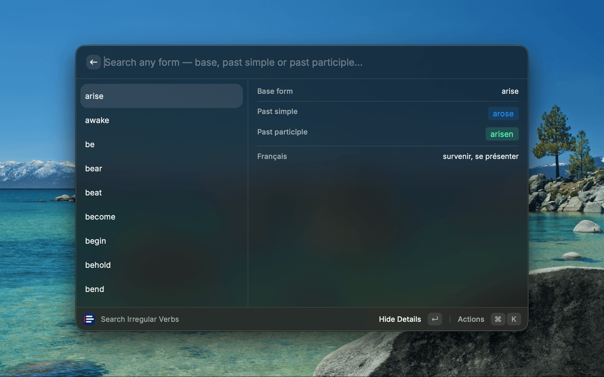

# English Irregular Verbs

Look up English irregular verbs and their three forms — **base**, **past simple** and **past participle** — without leaving your keyboard. Fuzzy search works across every form, so you can type any one of them and instantly find the verb.

## Features

- **Fuzzy search on every form.** Type `went`, `gone` or `go` — they all surface `go`.
- **All three forms at a glance.** Past simple and past participle are shown as colored tags.
- **Details view.** A metadata panel lays out each form clearly (toggle with the action panel).
- **Translations in 16 languages.** Optional translation row (see below).
- **UK & US spelling variants** included where relevant (e.g. `burnt / burned`), with a 🇺🇸 flag on the American form.
- **One-keystroke copy.** Copy all three forms at once, or each form (and the translation) individually with `⌘1` / `⌘2` / `⌘3` / `⌘4`.

## Translations

Each verb can show a translation in one of **16 languages**: French, Spanish, Italian, German, Brazilian Portuguese, Dutch, Swedish, Polish, Russian, Greek, Turkish, Arabic, Hindi, Chinese (Simplified), Japanese and Korean. The translation also feeds the fuzzy search (type `aller` to find `go`).

By default the language is **Auto**, which follows your operating system's UI language (e.g. `fr` → French, `de` → German, `ja` → Japanese; an unsupported language shows no translation). Detection works on **macOS, Windows and Linux** — it reads the OS language preference (`defaults` on macOS, `CurrentUICulture` on Windows, POSIX `LANG`/`LC_*` variables on Linux), falling back to the runtime locale.

To change it, open **Raycast → Settings → Extensions → English Irregular Verbs → Translation Language** and pick **Auto**, **None**, or any of the 16 languages.

## Data

Verbs live in `src/verbs.ts` as a typed `IrregularVerb[]` array. To add one, append a
`{ base, preterit, participle }` entry. Spelling variants are separated by ` / `
(e.g. `"burnt / burned"`) and every variant is indexed for search.

Translations live in `src/translations/` — **one file per language** (`fr.ts`, `de.ts`, `ja.ts`…),
each a `Record<string, string>` keyed by English base form. `src/translations/index.ts` assembles
them and declares the supported languages and their labels. American spelling variants flagged with
🇺🇸 are listed in `US_VARIANTS` in `src/index.tsx`.
